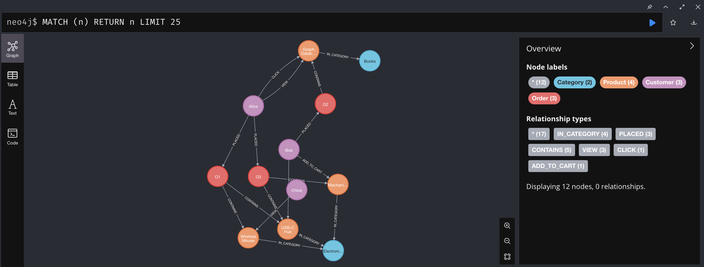
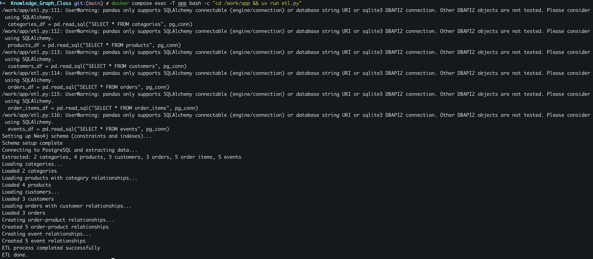
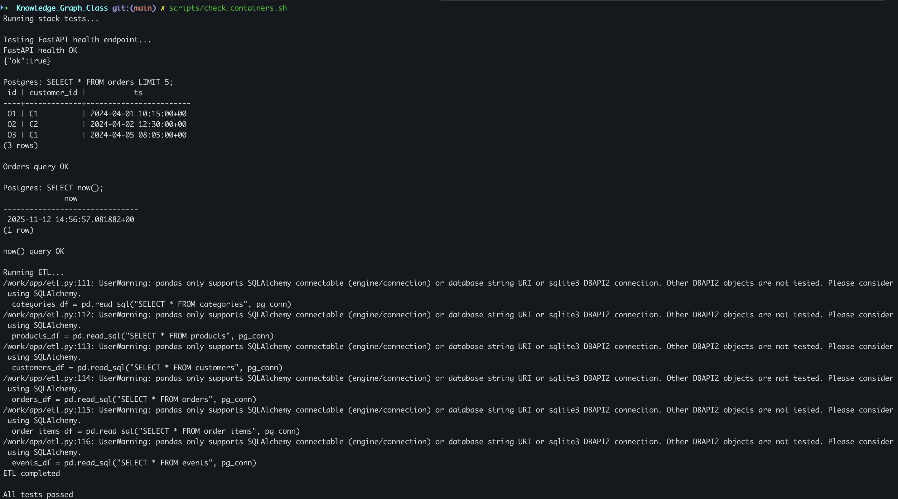

# GDB_TP_2 Submission

## 1. Neo4j Browser Screenshots

### Constraints
**Query:**
```cypher
SHOW CONSTRAINTS
```
**Screenshot:**

---

### Query 1: 
**Query:**
```cypher
MATCH (n) RETURN n LIMIT 25
```

**Screenshot:**

---

### Query 2:
**Query:**
```cypher
MATCH p=()-[r:VIEW]->() RETURN p LIMIT 25
```

**Screenshot:**

---

### Query 3:
**Query:**
```cypher
MATCH p=()-[r:IN_CATEGORY]->() RETURN p LIMIT 25
```

**Screenshot:**

---

## 2. Health Endpoint Output

**Command:**
```bash
curl "http://localhost:8000/health"
```

**Output:**

---

## 3. Running Docker containers
**Command**
```bash
docker compose up -d
```


---

## 3. Running ETL 
**Command**
```bash
docker compose exec app bash -c "cd /work/app && uv run etl.py"
```


---

## 3. Running Test Scripts 
**Command**
```bash
scripts/check_containers.sh"
```


---

## 4. Analysis

### Which recommendation strategies can you implement?

This graph structure enables several recommendation approaches. Collaborative filtering leverages ORDER-CONTAINS relationships to identify products frequently purchased together, allowing us to suggest items based on similar customer behaviors. Content-based filtering builds on IN_CATEGORY relationships to recommend new products from categories customers have already shown interest in. Additionally, graph algorithms like Personalized PageRank can weigh customer interactions (VIEW, CLICK, ADD_TO_CART) to predict which products they're most likely to purchase. Finally, community detection algorithms help identify customer segments with shared preferences, enabling targeted recommendations based on group behavior.

### What improvements would you make for production?

Moving to production requires several key enhancements. First, we need robust error handling and structured logging to facilitate debugging and system monitoring. Security is critical, so implementing authentication, authorization, and rate limiting would protect the API from abuse. Performance optimization through caching and scheduled ETL jobs (using tools like Airflow) would reduce database load and improve response times. Quality assurance demands comprehensive testing (unit, integration, end-to-end) alongside CI/CD pipelines for reliable deployments. Finally, scalability considerations like load balancing, backup strategies, API versioning, and thorough documentation would ensure the system can grow and remain maintainable over time.