# TP3 Query Reference and Results

## Practice Queries (16 Questions)

### Q1: Return 5 random User nodes

```cypher
MATCH (u:User)
RETURN u
ORDER BY rand()
LIMIT 5;
```

**Screenshot:**
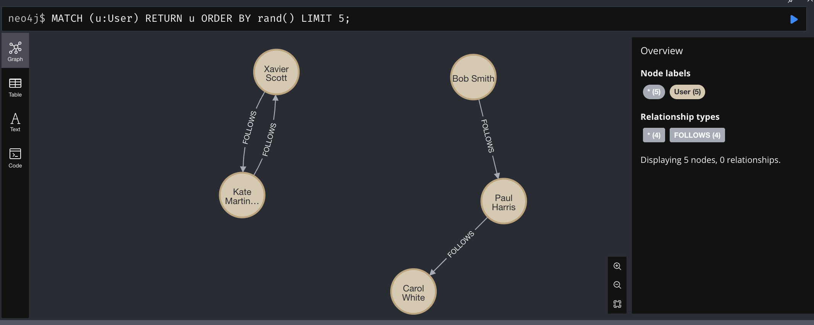

---

### Q2: Return 5 random relationships of any type

```cypher
MATCH ()-[r]->()
RETURN r
ORDER BY rand()
LIMIT 5;
```

**Screenshot:**


---

### Q3: Extract text property from three random Tweet nodes

```cypher
MATCH (t:Tweet)
RETURN t.text AS tweetText
ORDER BY rand()
LIMIT 3;
```

**Screenshot:**
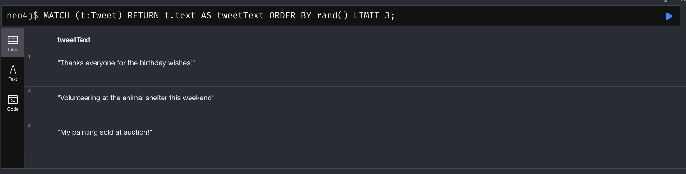

---

### Q4: Create visualization query for RETWEETS relationships

```cypher
MATCH (original:Tweet)<-[:RETWEETS]-(retweet:Tweet)
MATCH (original)<-[:PUBLISH]-(originalAuthor:User)
MATCH (retweet)<-[:PUBLISH]-(retweetAuthor:User)
RETURN original, retweet, originalAuthor, retweetAuthor
LIMIT 25;
```

**Screenshot:**
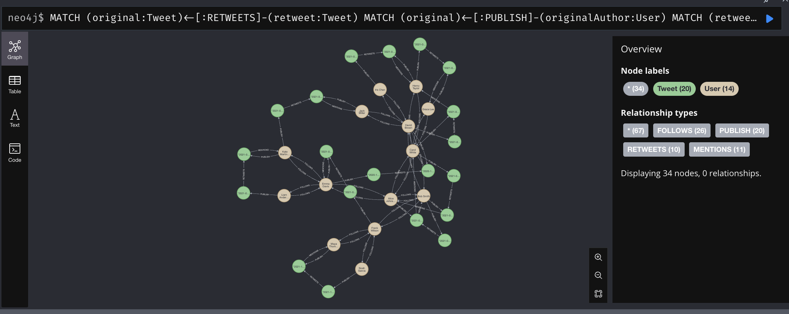

---

### Q5: MERGE vs CREATE - Explanation and Examples

**Explanation:**

MERGE is used when you want to match existing nodes or create them if they don't exist (idempotent)
CREATE always creates new nodes, even if they already exist (not idempotent)

**Use MERGE when:**
- Loading data that might have duplicates
- Ensuring uniqueness (e.g., users, tweets with unique IDs)
- Creating relationships between existing nodes

**Use CREATE when:**
- You're certain the node doesn't exist
- Initial data load with guaranteed unique data
- Performance is critical and you've validated uniqueness

**Example MERGE:**
```cypher
MERGE (u:User {id: 1})
ON CREATE SET u.name = 'Alice', u.created = timestamp()
ON MATCH SET u.lastSeen = timestamp()
```

**Example CREATE:**
```cypher
CREATE (t:Tweet {id: 101, text: 'Hello World', createdAt: datetime()})
```
---

### Q6: Calculate the ratio of missing createdAt values in Tweet nodes

```cypher
MATCH (t:Tweet)
WITH count(t) AS total
MATCH (t2:Tweet)
WHERE t2.createdAt IS NULL
WITH total, count(t2) AS missing
RETURN toFloat(missing) / total AS missingCreatedAtRatio;
```

**Screenshot:**


---

### Q7: Count the number of relationship types in the graph

```cypher
MATCH ()-[r]->()
RETURN type(r) AS relationshipType, count(r) AS count
ORDER BY count DESC;
```

**Screenshot:**
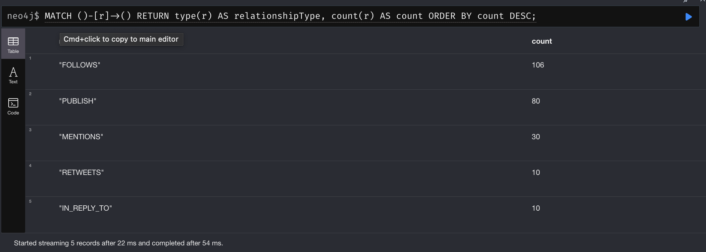

---

### Q8: Compare original tweet text with its retweet

```cypher
MATCH (original:Tweet)<-[:RETWEETS]-(retweet:Tweet)
RETURN original.text AS originalText,
       retweet.text AS retweetText
LIMIT 5;
```

**Screenshot:**


---

### Q9: Show the distribution of tweet creation by year

```cypher
MATCH (t:Tweet)
RETURN date.truncate('year', t.createdAt) AS year, count(t) AS tweetCount
ORDER BY year;
```

**Screenshot:**
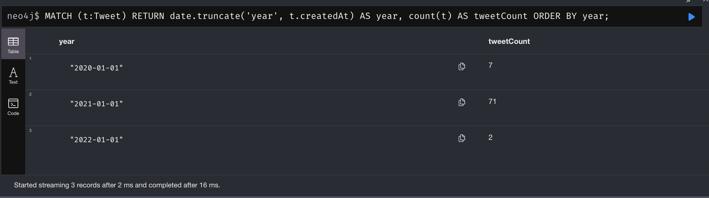

---

### Q10: Select all tweets created in 2021 using MATCH and WHERE

```cypher
MATCH (t:Tweet)
WHERE date.truncate('year', t.createdAt) = date('2021-01-01')
RETURN t.id, t.text, t.createdAt
ORDER BY t.createdAt
LIMIT 10;
```

**Screenshot:**


---

### Q11: Identify top four days by tweet creation count

```cypher
MATCH (t:Tweet)
WITH date.truncate('day', t.createdAt) AS day, count(t) AS tweetCount
RETURN day, tweetCount
ORDER BY tweetCount DESC, day DESC
LIMIT 4;
```

**Screenshot:**


---

### Q12: Count mentioned users with zero published tweets

```cypher
MATCH (u:User)
WHERE (u)<-[:MENTIONS]-() AND NOT (u)-[:PUBLISH]->()
RETURN count(u) AS mentionedButNeverPublished;
```

**Screenshot:**
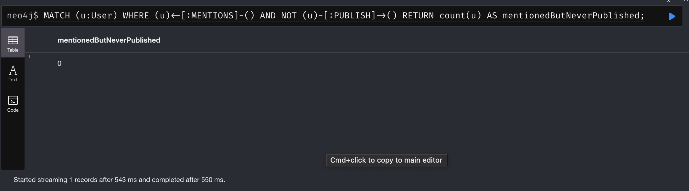

---

### Q13: Find top five users with most retweeted distinct tweets

```cypher
MATCH (u:User)-[:PUBLISH]->(t:Tweet)<-[:RETWEETS]-()
WITH u, count(DISTINCT t) AS distinctRetweetedTweets
RETURN u.id, u.name, u.username, distinctRetweetedTweets
ORDER BY distinctRetweetedTweets DESC
LIMIT 5;
```

**Screenshot:**


---

### Q14: Identify top five most-mentioned users

```cypher
MATCH (u:User)<-[:MENTIONS]-(t:Tweet)
WITH u, count(t) AS mentionCount
RETURN u.id, u.name, u.username, mentionCount
ORDER BY mentionCount DESC
LIMIT 5;
```

**Screenshot:**


---

### Q15: List ten most-followed users

```cypher
MATCH (u:User)<-[:FOLLOWS]-(follower:User)
WITH u, count(follower) AS followerCount
RETURN u.id, u.name, u.username, followerCount
ORDER BY followerCount DESC
LIMIT 10;
```

**Screenshot:**


---

### Q16: List ten users following the most people

```cypher
MATCH (u:User)-[:FOLLOWS]->(following:User)
WITH u, count(following) AS followingCount
RETURN u.id, u.name, u.username, followingCount
ORDER BY followingCount DESC
LIMIT 10;
```

**Screenshot:**
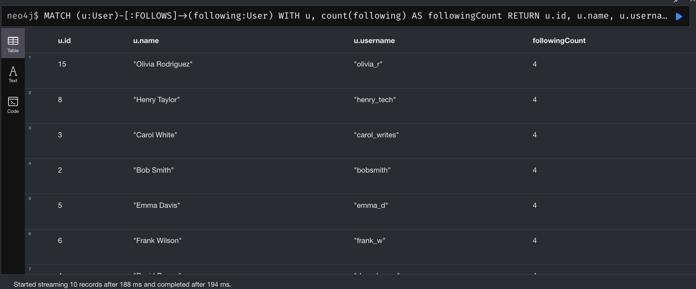

---

## Graph Data Science (GDS) Queries

### Step 1: Create graph projection for user network analysis

```cypher
CALL gds.graph.project(
    'userNetwork',
    'User',
    'FOLLOWS',
    {}
);
```

**Screenshot:**
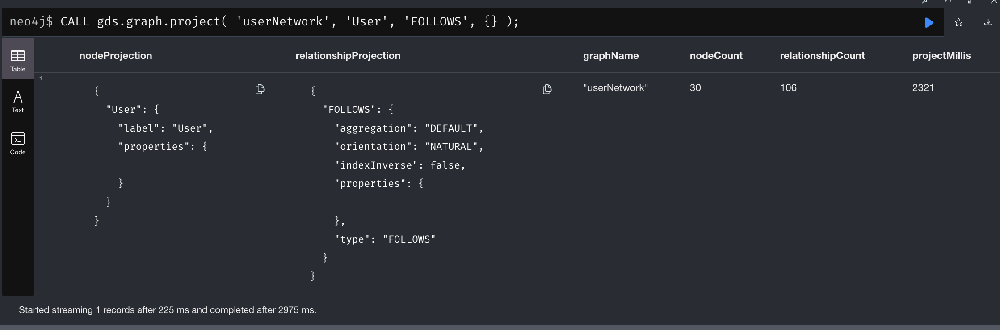

---

### PageRank - Identify influential users

```cypher
CALL gds.pageRank.stream('userNetwork')
YIELD nodeId, score
RETURN gds.util.asNode(nodeId).username AS username,
       gds.util.asNode(nodeId).name AS name,
       score
ORDER BY score DESC
LIMIT 10;
```

**Screenshot:**


---

### Betweenness Centrality - Find bridge users

```cypher
CALL gds.betweenness.stream('userNetwork')
YIELD nodeId, score
RETURN gds.util.asNode(nodeId).username AS username,
       gds.util.asNode(nodeId).name AS name,
       score
ORDER BY score DESC
LIMIT 10;
```

**Screenshot:**
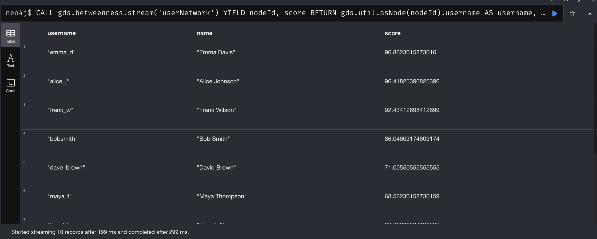

---

### Louvain Algorithm - Community detection

```cypher
CALL gds.louvain.stream('userNetwork')
YIELD nodeId, communityId
RETURN communityId,
       collect(gds.util.asNode(nodeId).username) AS members,
       count(*) AS memberCount
ORDER BY memberCount DESC;
```

**Screenshot:**

---

### Shortest Path - Find connection between two users

```cypher
MATCH (source:User {username: 'alice_j'})
MATCH (target:User {username: 'noah_g'})
MATCH path = shortestPath((source)-[:FOLLOWS*]-(target))
RETURN [node IN nodes(path) | node.username] AS pathNodes,
       length(path) AS pathLength;
```

**Screenshot:**
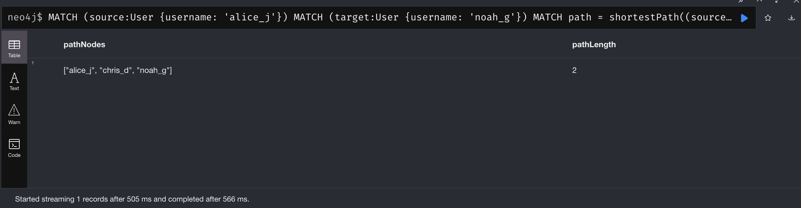

---

### Degree Centrality - Count direct connections

```cypher
MATCH (u:User)
WITH u,
     count{(u)-[:FOLLOWS]->()} AS following,
     count{(u)<-[:FOLLOWS]-()} AS followers
RETURN u.username, following, followers, following + followers AS totalConnections
ORDER BY totalConnections DESC
LIMIT 10;
```

**Screenshot:**
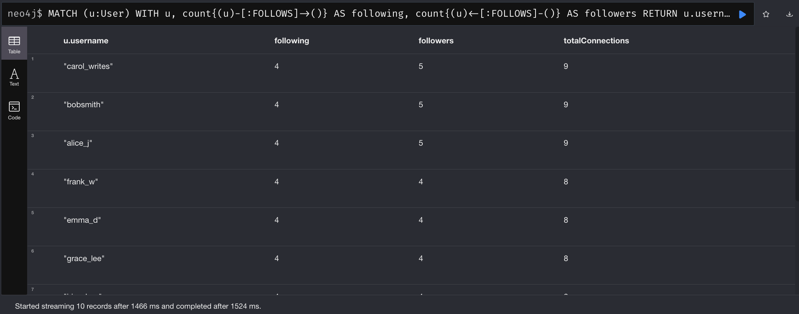

---

### Step 2: Create undirected graph projection for path-finding algorithms

```cypher
CALL gds.graph.project(
    'twitter_undirected',
    'User',
    {FOLLOWS: {orientation: 'UNDIRECTED'}}
);
```

**Screenshot:**
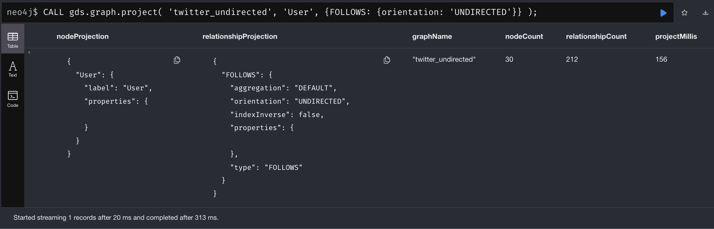

---

### GDS Dijkstra Shortest Path - Find shortest path using GDS

```cypher
MATCH (source:User {username: 'alice_j'})
MATCH (target:User {username: 'noah_g'})
CALL gds.shortestPath.dijkstra.stream('twitter_undirected', {
    sourceNode: source,
    targetNode: target
})
YIELD nodeIds, costs
RETURN [nodeId IN nodeIds | gds.util.asNode(nodeId).username] AS path,
       costs;
```

**Screenshot:**
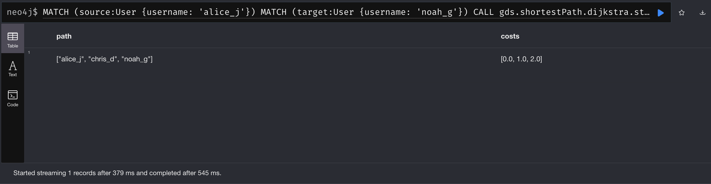

---

### Hop Distance Analysis - Find users within X degrees of separation

```cypher
MATCH (u:User {username: 'alice_j'})
MATCH (other:User)
WHERE u <> other
WITH u, other,
     shortestPath((u)-[:FOLLOWS*..3]-(other)) AS path
WHERE path IS NOT NULL
RETURN other.username, length(path) AS hops
ORDER BY hops, other.username
LIMIT 20;
```

**Screenshot:**


---

## GDS Write Operations - Store algorithm results as node properties

### Write PageRank scores to nodes

```cypher
CALL gds.pageRank.write('userNetwork', {
    writeProperty: 'pagerank',
    maxIterations: 20,
    dampingFactor: 0.85
})
YIELD nodePropertiesWritten, ranIterations;
```

**Screenshot:**


---

### Write Betweenness Centrality to nodes

```cypher
CALL gds.betweenness.write('userNetwork', {
    writeProperty: 'betweenness'
})
YIELD nodePropertiesWritten, centralityDistribution;
```

**Screenshot:**


---

### Write Louvain Community IDs to nodes

```cypher
CALL gds.louvain.write('userNetwork', {
    writeProperty: 'community'
})
YIELD nodePropertiesWritten, communityCount;
```

**Screenshot:**
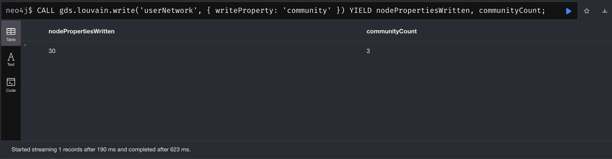

---

### Write Triangle Counts to nodes

```cypher
CALL gds.triangleCount.write('twitter_undirected', {
    writeProperty: 'triangles'
})
YIELD nodePropertiesWritten, globalTriangleCount;
```

**Screenshot:**
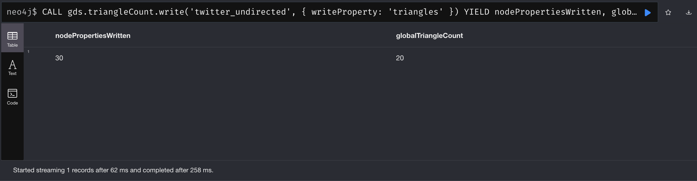

---

### Query nodes with written properties

```cypher
MATCH (u:User)
WHERE u.pagerank IS NOT NULL
RETURN u.username, u.pagerank, u.betweenness, u.community, u.triangles
ORDER BY u.pagerank DESC
LIMIT 10;
```

**Screenshot:**


---

### Clean up graph projections

```cypher
CALL gds.graph.drop('userNetwork');
CALL gds.graph.drop('twitter_undirected');
```

**Screenshot:**
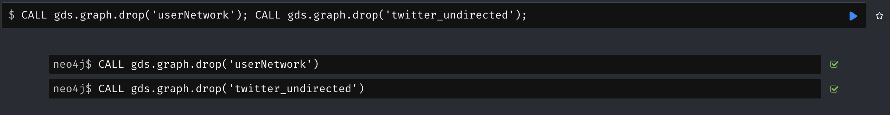