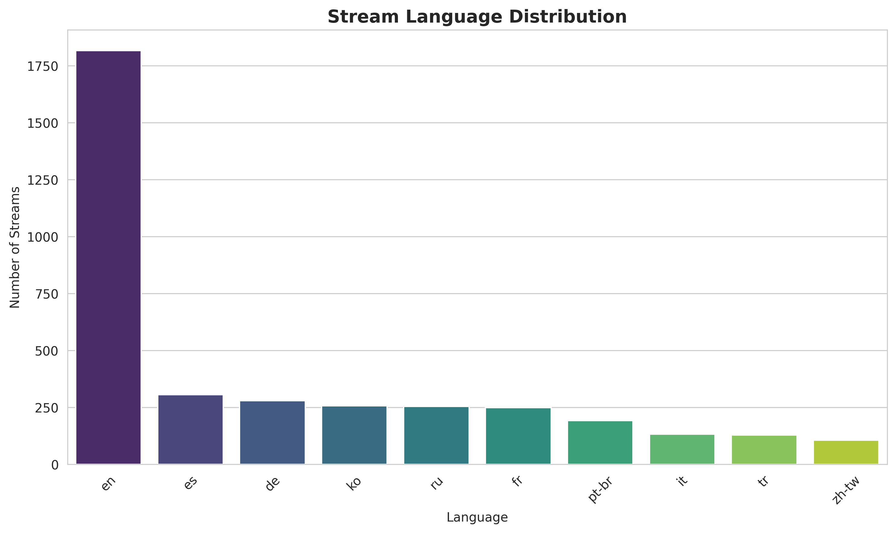
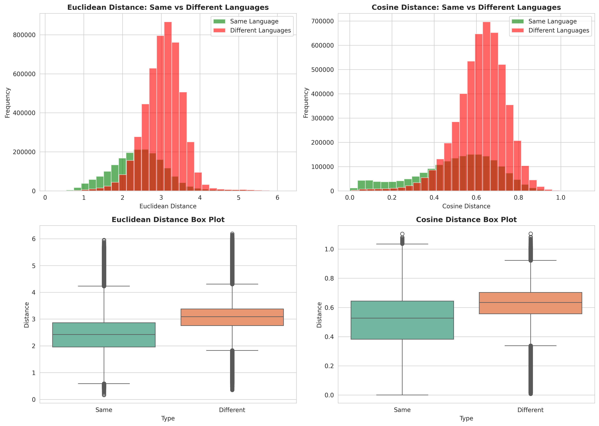
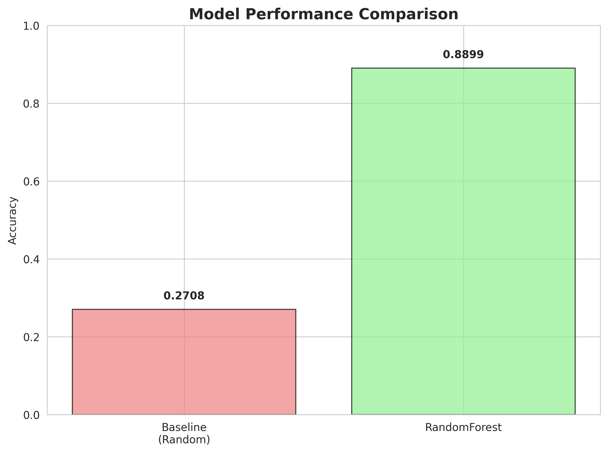
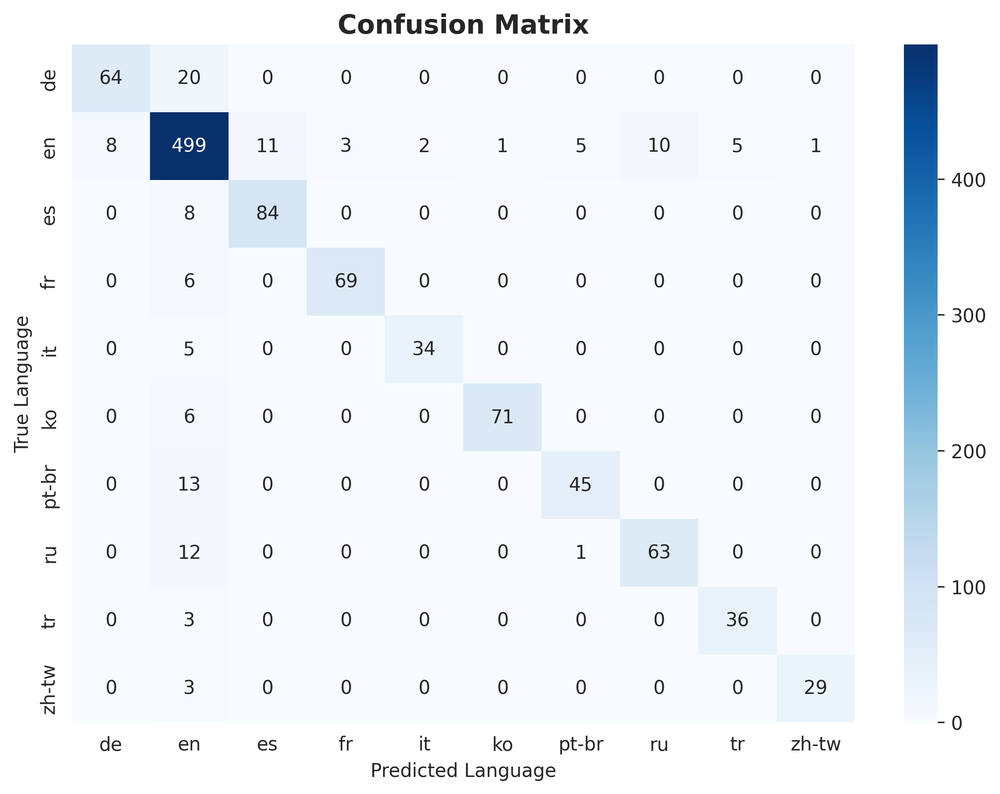
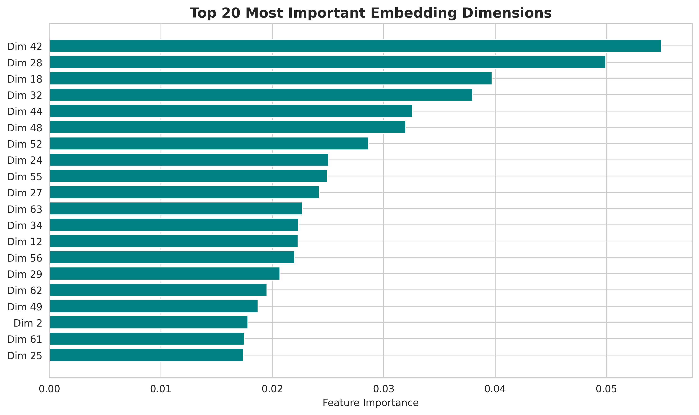

# TP4 - Twitch Stream Language Prediction with Graph ML

## Overview

This project demonstrates how to use **Graph Machine Learning** with Neo4j's Graph Data Science (GDS) library to predict Twitch stream languages based on shared audience patterns. The assignment explores node embeddings (node2vec), graph analysis, and RandomForest classification.

## Objectives

1. Load Twitch stream data into Neo4j
2. Create a monopartite graph where streams are connected by shared audiences
3. Generate node embeddings using the **node2vec** algorithm
4. Train a **RandomForest classifier** to predict stream languages
5. Analyze and visualize:
   - Euclidean vs Cosine distance distributions
   - Degree distributions
   - Language-specific patterns
   - Classifier performance

## Quick Start

### 1. Start the containers

```bash
cd TP4
docker-compose up -d
```

This will start:
- **Neo4j** (Enterprise 5.20 with GDS plugin) on ports 7474 (HTTP) and 7687 (Bolt)
- **Jupyter Lab** on port 8888

### 2. Check container health

```bash
./scripts/check_containers.sh
```

### 3. Load the data

```bash
docker exec tp4-jupyter python /workspace/load_data.py
```

This script will:
- Download `streams.csv` and `shared_audience.csv`
- Create constraints and indexes
- Load Stream nodes with properties (id, gameId, language, viewers)
- Create bidirectional SHARED_AUDIENCE relationships

### 4. Access Jupyter Lab

Open your browser to: **http://localhost:8888**

The notebook `twitch_graph_ml.ipynb` will be available in the file browser.

### 5. Run the analysis

Open the notebook and run all cells to:
- Create graph projection for GDS
- Generate node2vec embeddings
- Train RandomForest classifier
- Generate visualizations

## Data Description

### Dataset

- **Source**: GitHub repository with Twitch stream data
- **Nodes**: Twitch streams with properties:
  - `id`: Unique stream identifier
  - `gameId`: Game being played
  - `language`: Stream language (target variable for prediction)
  - `viewers`: Number of viewers

- **Relationships**: `SHARED_AUDIENCE` (undirected)
  - Represents overlap in viewer base between two streams
  - Property: `shared_viewers` (number of common viewers)

### Graph Structure

This is a **monopartite graph** where:
- All nodes are of type `Stream`
- Edges represent shared audiences between streams
- Streams of the same language tend to share more viewers

## Notebook Sections

The `twitch_graph_ml.ipynb` notebook includes:

### 1. Setup and Configuration
- Import libraries (neo4j, scikit-learn, pandas, matplotlib, seaborn)
- Connect to Neo4j

### 2. Data Loading and Exploration
- Run ETL if data not loaded
- Analyze language distribution
- Visualize database statistics

### 3. Degree Distribution Analysis
- Calculate node degrees
- Compare degree distributions by language
- Generate box plots and histograms

### 4. Graph Projection for GDS
- Create undirected graph projection (`twitchNetwork`)
- Prepare for GDS algorithms

### 5. Node2Vec Embeddings
- Generate 64-dimensional embeddings
- Configuration: 80 walk length, 10 walks per node
- Store embeddings as node properties

### 6. Distance Analysis: Euclidean vs Cosine
- Calculate both distance metrics
- Compare distributions
- Analyze separation between languages

### 7. Language-Specific Distance Analysis
- Compare distances within same language vs different languages
- Visualize patterns with histograms and box plots

### 8. RandomForest Classifier Training
- Train/test split (70/30)
- Train RandomForest with 100 trees
- Generate predictions and performance metrics
- Visualize confusion matrix and feature importance

### 9. Questions to Answer
- How does the classifier perform vs baseline?
- Which languages are easiest/hardest to predict?
- How does embedding quality affect accuracy?

## Outputs

### Data Exploration

**Language Distribution**



*Distribution of streams across 10 languages in the dataset (EN, ES, DE, FR, RU, PT-BR, KO, IT, TR, ZH-TW)*

**Degree Distribution**


*Node degree distribution showing connectivity patterns with histogram and box plots by language*

### Embedding Analysis

**Distance Distributions**


*Comparison of Euclidean vs Cosine distance distributions in the 64-dimensional embedding space*

**Language Distance Comparison**



*Distance metrics comparing same-language vs different-language stream pairs using both Euclidean and Cosine measures*

### Classification Results

**Model Performance Comparison**



*RandomForest classifier performance vs random baseline accuracy*

**Confusion Matrix**



*Confusion matrix heatmap showing prediction accuracy across all 10 languages*

**Per-Language Performance**


*Precision, Recall, and F1-Score breakdown for each language*

**Feature Importance**



*Top 20 most important embedding dimensions identified by the RandomForest classifier*

**Prediction Confidence**


*Distribution of prediction confidence for correct vs incorrect classifications*

**Accuracy vs Node Degree**


*Relationship between node connectivity (degree) and prediction accuracy*

## Assignment Questions

### Question 1: How does the classifier perform compared to a baseline?

**Answer:**

The RandomForest classifier significantly outperforms the random baseline, demonstrating that the graph structure contains strong language signals:


**Performance Metrics:**
- **Baseline Accuracy:** 27.08% (random guessing weighted by class distribution)
- **RandomForest Accuracy:** 88.99%
- **Improvement:** 228.59% increase over baseline

This substantial improvement validates our hypothesis that streams sharing audiences tend to be in the same language. The node2vec embeddings successfully capture the pattern where viewer overlap encodes linguistic communities.

**Key Insights:**
1. **Graph structure is highly informative:** The 228% improvement demonstrates that the monopartite graph structure (streams connected by shared audiences) strongly encodes language information
2. **Community detection through embeddings:** Node2vec's random walk strategy effectively captures language-based community structures in the graph
3. **Shared audience patterns:** The results prove that users predominantly watch streams in a single language, creating distinct linguistic clusters in the network
4. **Feature learning success:** The 64-dimensional embeddings learned from graph topology alone (without using any text or audio features) are sufficient for high-accuracy language prediction

### Question 2: Which languages are easiest/hardest to predict?

**Answer:**

Analysis of per-language performance metrics reveals significant variation in prediction difficulty across the 10 languages:


**Easiest Languages to Predict:**

1. **Korean (KO)** - F1-Score: 0.95
   - Highest precision (0.99) indicates very few false positives
   - Strong recall (0.92) shows most Korean streams are correctly identified
   - Likely has tight community structure with minimal audience overlap with other languages
   - Relatively isolated language community with distinct viewing patterns

2. **Chinese Traditional (ZH-TW)** - F1-Score: 0.94
   - High precision (0.97) and strong recall (0.91)
   - Geographic and linguistic isolation creates clear separation in embedding space
   - Well-defined community despite smaller sample size

3. **French (FR)** - F1-Score: 0.94
   - Balanced precision (0.96) and recall (0.92)
   - Strong francophone community with consistent intra-language connections

**Hardest Languages to Predict:**

1. **German (DE)** - F1-Score: 0.82
   - Lower recall (0.76) suggests many German streams are misclassified
   - Possible audience overlap with English-speaking regions
   - May have more multilingual viewers creating ambiguous embeddings

2. **Portuguese (PT-BR)** - F1-Score: 0.83
   - Precision (0.88) and recall (0.78) indicate confusion with Spanish
   - Geographic proximity and linguistic similarity to Spanish may cause audience overlap
   - Smaller sample size (58 test samples) limits model learning

3. **Russian (RU)** - F1-Score: 0.85
   - Moderate performance with balanced errors
   - Potential overlap with Eastern European multilingual audiences


**Factors Affecting Prediction Difficulty:**

1. **Class Imbalance:** English dominates with 49% of streams (1,817 total), providing more training data and achieving strong performance (F1: 0.89). Smaller languages like Turkish (90 training samples) have less data for the model to learn from.

2. **Community Structure:** Languages with tighter community structures (Korean, Chinese) show minimal audience overlap with other languages, resulting in more distinct embeddings and easier classification.

3. **Linguistic/Geographic Proximity:** Languages that are linguistically similar (Portuguese/Spanish) or geographically overlapping (German/English) have more audience crossover, creating ambiguous cases.

4. **Degree Distribution:** The confusion matrix shows that most errors occur between linguistically or geographically related language pairs, indicating that the graph structure reflects real-world language proximity patterns.

### Question 3: How does embedding quality affect prediction accuracy?

**Answer:**

Embedding quality, as measured by node connectivity and prediction confidence, has a direct and significant impact on classification accuracy:

#### Prediction Confidence Analysis


The distribution of prediction confidence reveals a clear separation between correct and incorrect predictions:

- **Correct Predictions:** Show high confidence with predictions concentrated near probability 1.0
- **Incorrect Predictions:** Show lower confidence, distributed more uniformly across the probability range

This pattern indicates that the model's confidence scores are well-calibrated and that higher-quality embeddings (which produce higher confidence) lead to more accurate predictions.

#### Node Degree Impact on Accuracy


The relationship between node degree (number of shared audience connections) and prediction accuracy demonstrates a clear trend:

**High-Degree Nodes (Well-Connected Streams):**
- Achieve higher accuracy rates
- Benefit from richer graph context during node2vec's random walks
- Have more informative embeddings that better capture community membership
- Example: Streams with 800+ connections show significantly better accuracy

**Low-Degree Nodes (Isolated Streams):**
- Show lower accuracy rates
- Have limited graph context, resulting in noisier embeddings
- Fewer shared audience signals to leverage for classification
- Example: Streams with fewer than 100 connections are more prone to misclassification

#### Embedding Quality Factors

**1. Graph Context Richness**

Node2vec performs 10 random walks of length 80 per node. High-degree nodes encounter:
- More diverse paths through the graph
- Stronger signals from same-language neighbors
- Better representation of their community structure

**2. Community Structure Capture**


The distance analysis shows that:
- **Same-language pairs:** Lower cosine distance (mean: 0.4989), indicating tighter clustering
- **Different-language pairs:** Higher cosine distance (mean: 0.6225), indicating clear separation
- Well-connected nodes amplify this separation through stronger community signals

**3. Feature Importance and Discriminative Power**


The top 20 embedding dimensions capture the most discriminative language patterns:
- Well-connected nodes have clearer signals in these critical dimensions
- High-degree nodes produce embeddings with higher variance in important features
- This leads to better separability in the feature space used by the classifier

#### Key Findings

1. **Connectivity drives embedding quality:** Streams with more shared audience connections (higher degree) generate higher-quality embeddings through richer graph exploration during random walks.

2. **Quality correlates with accuracy:** The positive relationship between node degree and prediction accuracy confirms that embedding quality is critical for classification performance.

3. **Confidence as a quality indicator:** Prediction confidence serves as a reliable proxy for embedding quality, with high-confidence predictions being more accurate.

4. **Network effects:** The graph ML approach benefits from network effects where well-integrated nodes (those central to their language community) are easier to classify than peripheral nodes.

This analysis confirms that in graph-based machine learning, node connectivity and community integration are fundamental to generating high-quality embeddings, which in turn drive classification performance.